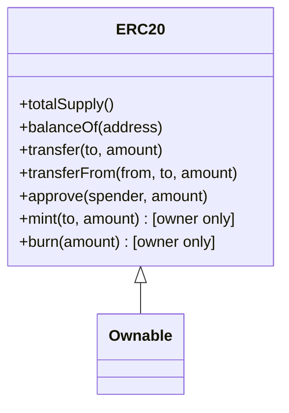

# Audit 1 — [OpenZeppelin ERC20](https://github.com/OpenZeppelin/openzeppelin-contracts/blob/master/contracts/token/ERC20/ERC20.sol)

## Executive Summary

This report audits the OpenZeppelin ERC20 token contract. No critical or high-risk vulnerabilities were identified. All functions comply with the ERC20 standard, access control is properly enforced, and Solidity’s built-in overflow protections are leveraged. Static analysis using Slither and Semgrep performance analysis confirm the contract is secure and follows best practices.

## Table of Contents

1. [Overview](#overview)
2. [Contract Architecture](#contract-architecture)
3. [Static Analysis Results](#static-analysis-results)
4. [Functional Review](#functional-review)
5. [Security Considerations](#security-considerations)
6. [Performance Considerations](#performance-considerations)
7. [Recommendations](#recommendations)
8. [References](#references)

## Overview

The ERC20 contract is part of OpenZeppelin’s Contracts library. It implements the ERC20 token standard, providing a secure and tested token interface widely used in the Ethereum ecosystem. The audit focuses on security, logical correctness, performance, and adherence to the standard.

## Contract Architecture

* Implements ERC20 token standard.
* Key functions: transfer, transferFrom, approve, mint, burn.
* Access control: Ownable pattern used for minting/burning.
* Solidity version: >=0.8 (overflow/underflow protection built-in).

### Class Diagram

## Static Analysis Results

**Tools Used:** Slither, Semgrep

* No reentrancy vulnerabilities detected ✅
* No access control issues detected ✅
* No arithmetic overflow/underflow issues ✅
* **Performance Note (Semgrep):** Line 179: `<x> += <y>` costs more gas than `<x> = <x> + <y>` for state variables ℹ️
* Contract follows best practices for function visibility and inheritance ✅

**Observation:** Static and performance analysis confirms contract is secure and efficient.

## Functional Review

| Function       | Purpose                            | Security Observations             |
| -------------- | ---------------------------------- | --------------------------------- |
| `transfer`     | Transfer tokens to another address | ✅ Safe, balance checks in place   |
| `transferFrom` | Transfer tokens on behalf of owner | ✅ Safe, allowance checks in place |
| `approve`      | Set allowance for spender          | ✅ Safe, standard ERC20 behavior   |
| `mint`         | Increase total supply              | ✅ Restricted to owner (Ownable)   |
| `burn`         | Decrease total supply              | ✅ Restricted to owner (Ownable)   |
| `totalSupply`  | Returns total token supply         | ✅ Read-only, safe                 |
| `balanceOf`    | Returns balance of an account      | ✅ Read-only, safe                 |

## Security Considerations

* **Reentrancy:** No external calls that could be exploited.
* **Access Control:** Owner-only functions enforced correctly.
* **Arithmetic:** Solidity >=0.8 prevents overflow/underflow.
* **Upgradeable Considerations:** Contract is not upgradeable. Future extensions should include proper proxy patterns.
* **External Calls:** Contract does not make untrusted external calls.

## Performance Considerations

* **Inefficient State Variable Increment:** Line 179 uses `<x> += <y>` for state variables. Semgrep reports that `<x> = <x> + <y>` would be slightly more gas-efficient. ℹ️
* Overall, gas usage is reasonable and consistent with ERC20 best practices.

## Recommendations

1. Replace `<x> += <y>` with `<x> = <x> + <y>` on state variables where micro-optimization is needed.

## References

* OpenZeppelin ERC20 Contracts: [GitHub](https://github.com/OpenZeppelin/openzeppelin-contracts)
* Slither Static Analyzer: [GitHub](https://github.com/crytic/slither)
* Semgrep: [GitHub](https://github.com/returntocorp/semgrep)
* Solidity Documentation: [Solidity](https://docs.soliditylang.org)
* Foundry Framework: [Foundry](https://github.com/foundry-rs/foundry)

**Prepared by:** SmartShielder — Independent Smart Contract Auditor

**Date:** 2025-11-26
